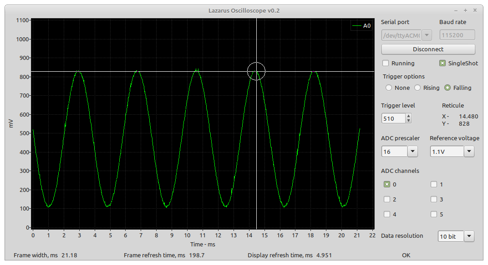
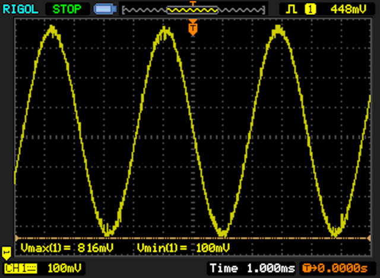
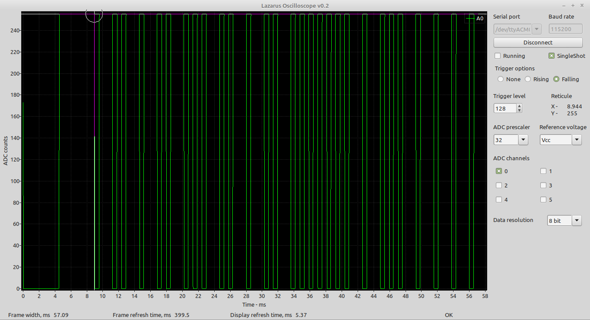

# LazScope
FPC/Lazarus serial oscilloscope
This oscilloscope project consists of two parts: a microcontroller that read analog signals via its ADC peripheral, and an application that runs on a computer that requests data over a serial connection with the microcontroller.

## Functionality
### Connection
A serial connection needs to be established between the application and the microcontroller. The serial port cab be selected by clicking on the dropdown list nad selecting the appropriate serial device. If the actual serial device is not listed, the full name can be typed into the dropdown text box. The baud rate is determined by the settings used in the microcontroller firmware - typically 115200. The baud rate can be edited to suit the microcontroller firmware.

### Running and SingleShot
Data acquisition is started by clicking on _Running_.  After a data frame has been received, a new data acquisition request is sent to the micrcontroller.  This continues until _Running_ is unselected.  If the _SingleShot_ option is selected, a single data frame is requested and displayed after enabling the _Running_ mode. Once the data frame is received _Running_ is automatically disabled, so that the received data can be inspected.

### Trigger mode
There are two optional trigger modes: _Rising_ and _Falling_. If for example the _Rising_ trigger is selected, then data samples are evaluated until a data sample below the trigger level is followed by a data sample above the trigger level.  Data capture is delayed until a trigger condition is met, a certain number of data samples have been evaluated, or until approximately 4 seconds have expired. Note that the trigger is only applied on the first selected channel.

Valid trigger values are between 0 and the maximum range for the current ADC setting in either ADC counts or mV, depending on the reference voltage and data resolution settings. Internally the trigger value is rounded down to the nearest multiple of 4.

### Reticule
A reticule ("crosshair") tool is available which will snap to the nearest data point and display its coordinates.  Activate this by pressing the Alt button while moving the mouse pointer close to the signal trace. Note that the mouse pointer needs to be within a certain distance of a data point before the reticule will snap to it.

### ADC prescaler
This allows changing the data sampling frequency. Increasing the prescaler value results in lower data sampling frequency. Note that the atmega328p datasheet recommends a limit of 200 kHz sampling frequency by the ADC (about 65 microseconds acquisition time) to maintain maximum accuracy. Selecting small prescaler values may therefore result in inaccurate results.

### Reference Voltage
Different voltage references can be selected for the ADC. The options include _Vcc_, _1.1V_ and _Aref_. The attinyx5 series has another internal reference voltage which can be selected: _2.56V_ (without an external bypass capacitor).

### ADC channels
One or more of the available ADC channels can be selected for sampling. If more than one channel is selected, the channels will be sampled sequentially. Note that on low pin count microcontrollers (such as the attinyx5 series) some of the ADC capable pins are used for other functions such as serial pins or frequency output and will not be listed.

### Data Resolution
The ADC of the classic AVR microcontrollers typically have a resolution of 10 bits. These 10 bit values are stored and transmitted by packing two values into 3 bytes. To increase the number of samples that can be stored in one data frame, the data can be stored as 8 bit values. On the flash constrained microcontrolles (attiny24 and attiny25) only the 8 bit data option is available.

## Firmware
### Firmware configuration
The baud rate defaults to 115200, but can be changed by defining BAUD, e.g. via command line: _-dBAUD=38400_.

The firmware code needs to know the system clock frequency for certain timing calculations. The system clock frequency should be specified via the F_CPU define,e.g. via command line: _-dF_CPU:=16000000_.

### Supported controllers
The code is factored to be compatible with the following microcontroller families:
* atmegaxx8 (atmega48, atmega88, atmega168, atmega328p)
* attinyx4 (attiny24, attiny44, attiny84)
* attinyx5 (attiny25, attiny45, attiny85)

The firmware was tested on atmega328p, attiny24, attiny45 and attiny85 microcontrollers.

### Square wave generator
A square wave signal of 500 Hz is generated by the firmware. The pin number for this output is shown in the table below.

### Serial and square wave pins
Controller | TX | RX | Square wave pin
---------- | --- | --- | ---------
atmegaxx8 | PC0 | PC1 | PD3
attinyx4 | PB2 | PB1 | PA7
attinyx5 | PB2 | PB1 | PB0

## Examples
### Middle C note
A middle C note (261.6 Hz) sinusoidal wave captured from a headphone output jack using a [DC offset circuit](images/DC_offset_circuit.png):

The same waveform captured with a Rigol DS1102E oscilloscope for reference:

### Infrared remote signal
A capture of the power button on an LG 6711R1P070B remote controle using a cheap infrared demodulator. Note that the signal logic is reversed, that is a high value indicates no signal from the IR transmitter.

